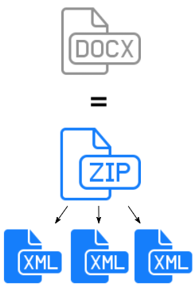
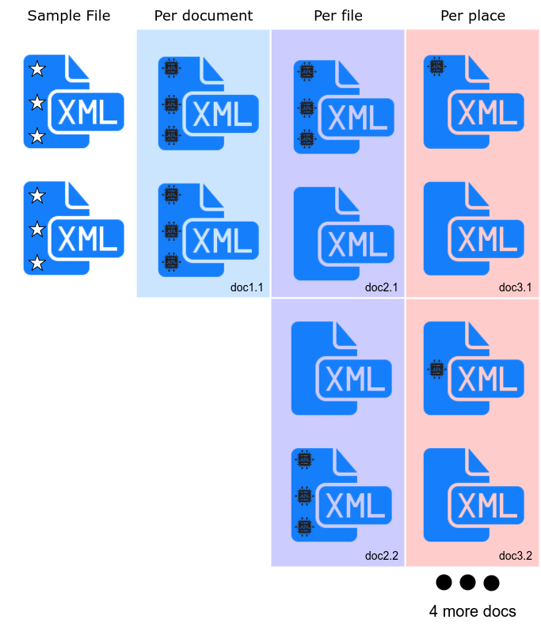
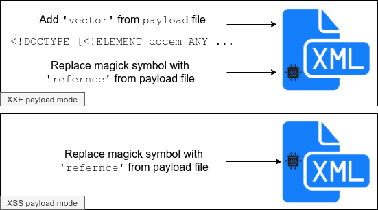
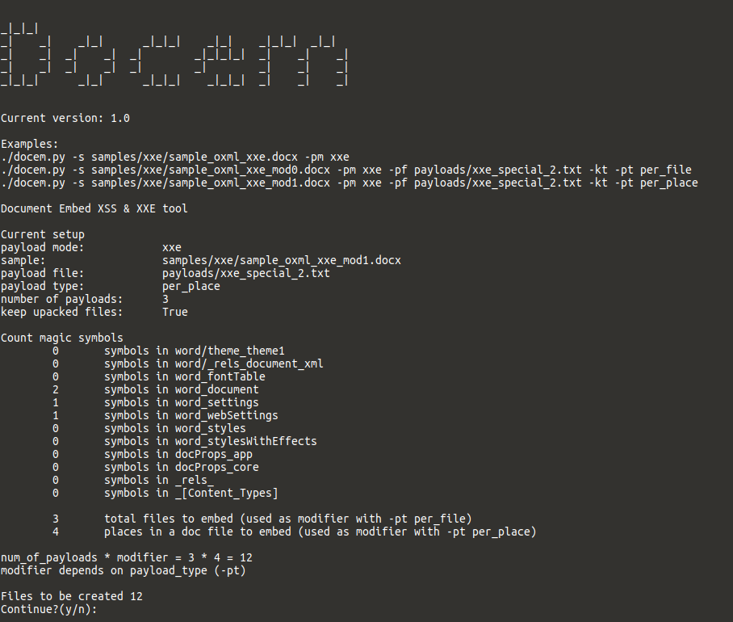

```
_|_|_|                                                  
_|    _|    _|_|      _|_|_|    _|_|    _|_|_|  _|_|    
_|    _|  _|    _|  _|        _|_|_|_|  _|    _|    _|  
_|    _|  _|    _|  _|        _|        _|    _|    _|  
_|_|_|      _|_|      _|_|_|    _|_|_|  _|    _|    _|

version 1.5
```


A utility to embed XXE and XSS payloads in docx, odt, pptx, etc - any documents that is a zip archive with bunch of xml files inside.

This tool is a side-project of a colloborative research of document's internal structure with [ShikariSenpai](https://twitter.com/ShikariSenpai) and [ansjdnakjdnajkd](https://twitter.com/ansjdnakjdnajkd) 


## What it is all about

A lot of common document formats, such as doc,docx,odt,etc are just a zip files with a few xml files inside.



So why don't we try to embed XXE payloads in them?  
That was done in a great [research](http://oxmlxxe.github.io/reveal.js/slides.html#/) by Will Vandevanter (`_will_is`)
To create such documents with embedded payloads there is a famous tool called [oxml_xxe](https://github.com/BuffaloWill/oxml_xxe). 

But. It is not convenient to use `oxml_xxe` when you need to create hundreds of documents with payloads in different places.
So there it goes - Docem.

It works like that: You specify sample document - that is a doc that contains `magic_symbols` (in illustrations it is marked as `፨` (in program it is constant `XXCb8bBA9XX`)) that will be replaced by a XXE or XSS payload.

Also there are three different types of `payload_type` - every type determines how every `magic_symbol` will be processed for a given file in a document.
Every `payload_type` described in a section `Usage`.
Here is a small scheme of how this works:



Payload modes



Programm interface




## Install 

```bash
pip3 install -r requirements.txt
```

## Usage Docem

```
python3 docem.py --help
```


- required args
	- `-s` - path to a `sample file` or a `sample directory`. That sample will be used to create a document with an attacking vector.
	- `-pt` - payload type
		- `xss` - XSS - Cross Site Scripting 
		- `xxe` - XXE - External XML Entity 
- optional
	- `-pm` - payload mode
		- `per_document` - (default mode) for every payload, embed payload in all places in all files and create new document
		- `per_file` - for every payload, for every file inside a document, for all places inside a file embed a payload and create a new document
		- `per_place` - for every payload, for every place in every file, embed a payload and create a new doc
	- `-pf` - payload file
	- `-sx ` - sample extension - used when sample is a directory
	- `-h` - print help

Examples 
```bash
./docem.py -s samples/marked/docx_sample_oxml_xxe_mod0/ -pt xxe -pf payloads/xxe_special_6.txt -pm per_document -sx docx
./docem.py -s samples/marked/docx_sample_oxml_xxe_mod1/ -pt xxe -pf payloads/xxe_special_1.txt -pm per_file -sx docx
./docem.py -s samples/marked/sample_oxml_xxe_mod1.docx -pt xxe -pf payloads/xxe_special_2.txt -pm per_place
./docem.py -s samples/marked/docx_sample_oxml_xxe_mod0/ -pt xss -pf payloads/xss_tiny.txt -pm per_place -sx docx
```

An equivalent to a `docx` file created by `oxml_xxe`. The command bellow will create docx files with embedded XXE payloads.
```bash
./docem.py -s samples/marked/docx_sample_oxml_xxe_mod0/ -pt xss -pf payloads/xxe_special_6.txt -pm per_document -sx docx
```

Tool output is saved under `./tmp/` folder


## How to create custom sample


### Via new folder sample


1. Unzip your document `new_sample_from_folder.docx` to a folder `new_sample_from_folder/` or use already existing clear sample by coping it from `samples/clear/<sample_name>` to `samples/marked/new_sample_from_folder/`
2. Add magic symbols - `XXCb8bBA9XX` (depicted as `፨` in illustrations of this readme) in places where you want payloads to be embedded
3. Use new sample with the tool as `-s samples/new_sample_from_folder/ -sx docx`


### Via new file sample

1. Add magic symbols (`XXCb8bBA9XX`) to various places in you custom document `new_sample.docx` 
2. Use new sample as `-s new_sample.docx`


## Payload file formats used in the tool

### XSS payloads

Format: TXT file that contains list strings. Example:
```
<svg/src=x/onerror=alert(1)>
<xss onafterscriptexecute=alert(1)><script>1</script>
```

### XXE payloads

Tools uses **Special format** for XXE payloads. If you want to add additional payloads, please use an example bellow as a reference.

Format: TXT file that contains list dictionaries. Example


```
{"vector":"<!DOCTYPE docem [<!ENTITY xxe_canary_0 \"XXE_STRING\">]>","reference":"&xxe_canary_0;"}
{"vector":"<!DOCTYPE docem [<!ELEMENT docem ANY ><!ENTITY xxe_canary_2 SYSTEM \"file:///etc/lsb-release\">]>","reference":"&xxe_canary_2;"}
```

- `vector` - required key word - script will be searching for it 
- `<!DOCTYPE docem [<!ENTITY xxe_canary_0 \"XXE_STRING\">]>` - payload. Warning all double quotation marks `"` must be escaped with one backslash `\` => `\"`
- `reference` - required key word - script will be searching for it 
- `&xxe_canary_0;` - reference that will be add in all places with magic symbol 


## Features and ToDo

- Features
	- [x] Read file with payloads
		- [x] XXE custom payload file
		- [x] XSS payload file
- ToDo
	- [x] Add ability to embed not only in xml but in unzip file also
	- [ ] Add flag to specify custom url to use in XXE
	- [ ] Add flag to specify custom url to use in XSS

